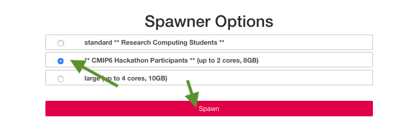

# Pangeo cloud demo - Princeton Geoclim Group

To explore the data available in the cloud check out the full [catalogue](https://pangeo-data.github.io/pangeo-datastore/cmip6_pangeo.html).

Then head to [pangeo.ocean.io](https://ocean.pangeo.io/) and spawn a jupyterlab notebook

> In order to use [cmip6_preprocessing](https://github.com/jbusecke/cmip6_preprocessing), you need to install it manually whenever you start a new session (it is wiped when you close the session). You can achieve this by either opening a new terminal (+ in the upper left corner) and executing the setup script with `./setup_script`. Or open a notebook and execute `!pip install git+https://github.com/jbusecke/cmip6_preprocessing.git` (You can execute shell commands in notebooks by appending `!`). **In the later case you have to restart the notebook once**.

Have fun exploring the cloud.