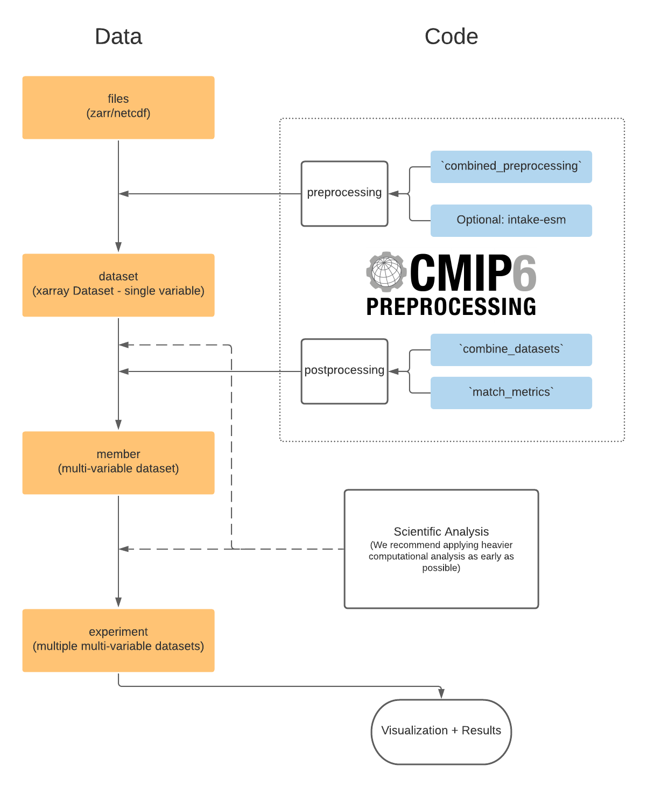

.. xmip documentation master file, created by
   sphinx-quickstart on Thu Feb 25 16:11:36 2021.
   You can adapt this file completely to your liking, but it should at least
   contain the root `toctree` directive.

Analysis ready CMIP6 data with Pangeo
=====================================

Modern climate science like the IPCC rely heavily on model inter comparison projects (MIPs). These projects essentially pool together model results from various climate modeling centers around the world, that were run according to specific protocols, in order to compare, for instance, the response of the coupled climate system to changes in forcing.

The vast amount of work that has been put into the standardization of these experiments enables climate scientists to use a wealth of data to answer their specific questions, thus refining future models and increasing our understanding of the complex system that is our home planet.

However, from the viewpoint of analyzing these data, the output is still quite 'dirty' making the quintessential workflow of:

1. Develop a metric/analysis to apply to one model.
2. Run that analysis across all the models  and interpret results.

inherently difficult.

Most of the problems arise from differences in the convention the model output is provided in. This includes, but is not limited to different naming conventions for coordinate variables,  units, grid variables.
`xmip` aims to provide lightweight tools, that let you get right to the science, without spending hours on cleaning up the data.

Installation
------------

Installation from Conda Forge
^^^^^^^^^^^^^^^^^^^^^^^^^^^^^

The easiest way to install xMIP along with its dependencies is via conda
forge::

    conda install -c conda-forge xmip

Installation from Pip
^^^^^^^^^^^^^^^^^^^^^

An alternative is to use pip::

    pip install xmip

Installation from GitHub
^^^^^^^^^^^^^^^^^^^^^^^^

You can get the newest version by installing directly from GitHub::

    pip install git+https://github.com/jbusecke/xmip.git

Getting Started
---------------

The most basic functionality is provided by the `combined_preprocessing` function. Check out the `tutorial <tutorial.ipynb>`_ for a brief introduction of the basic functionality.

Suggested Workflow
------------------

We aim to provide a flexible solution for many scientific workflows which might need combination of datasets at different 'levels'.

The `preprocessing` module deals with 'cleaning' single variable datasets (e.g. from a single zarr store in the `pangeo CMIP6 cloud data <https://pangeo-data.github.io/pangeo-cmip6-cloud/>`_ or a dataset loaded from mulitple netcdf files on a local server/HPC).

It is often desired to remove control run drift from the data before running analyses. Check out the `drift_removal` module for utilities based on aligning/detrending branched runs.

Depending on your science goal, you might need to combine several datasets into members (multi variable datasets) or even further. These combination tasks are facilitated by the `postprocessing` module. This provides the ability to 'match and combine' datasets based on their attributes. For more detailed examples please check out the `Postprocessing` section.

The `regionmask` module enables you to create basin masks for each model (and any other data with longitude/latitude values)

.. I need to check out how to link the API sections and from within notebooks properly. Look into https://myst-nb.readthedocs.io/en/latest/

Contents
--------

.. toctree::
   :maxdepth: 1

   tutorial
   postprocessing
   drift_removal
   regionmask
   contributor-guide
   api
   whats-new

.. toctree::
   :maxdepth: 2
   :caption: Contents:

Indices and tables
==================

* :ref:`genindex`
* :ref:`modindex`
* :ref:`search`
